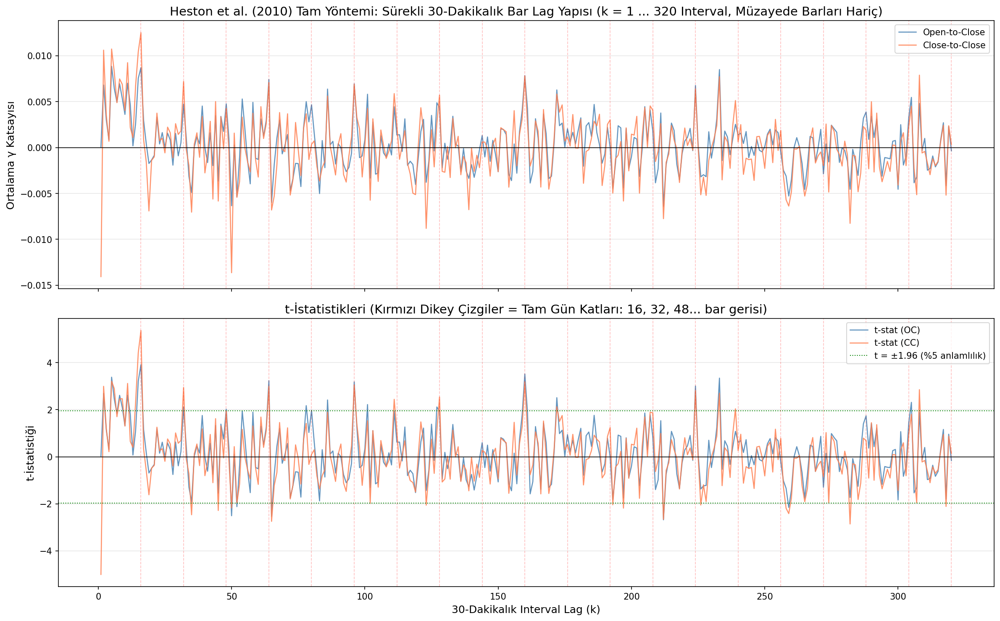
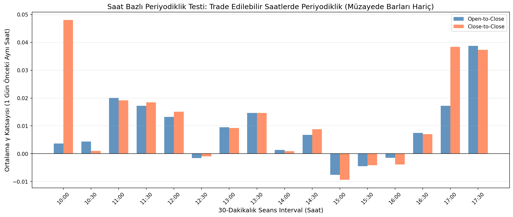
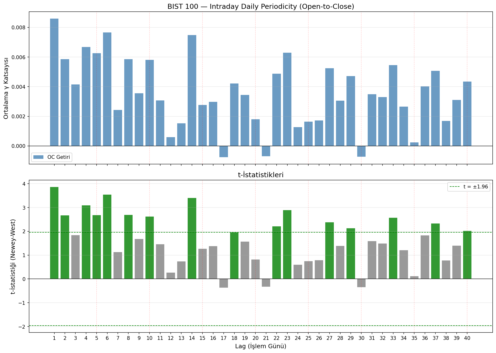
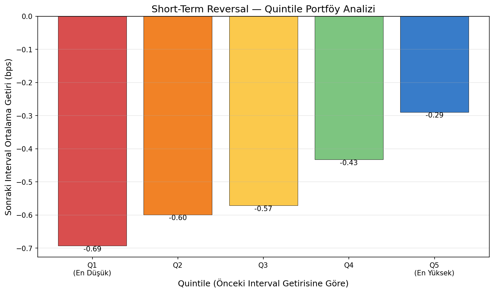

# BIST 100 Intraday Daily Periodicity & Short-Term Reversal Analizi

## Referans Makale
Heston, S.L., Korajczyk, R.A., & Sadka, R. (2010). "Intraday Patterns in the 
Cross-Section of Stock Returns." *Journal of Finance*, 65(4), 1369-1407.

---

## 1. Veri Seti Özeti

- **Hisse sayısı:** 28
- **Dönem:** 2022-01-03 – 2026-07-27
- **Toplam gözlem:** 507,532
- **İşlem günü:** ~1140
- **Veri frekansı:** 30 dakikalık OHLC (16 trade edilebilir interval/gün, müzayede barları hariç)
- **Hariç tutulan barlar:** 09:30 (açılış müzayedesi), 18:00 (kapanış müzayedesi)
- **Hacim verisi:** Mevcut değil

## 2. Hisse Bazlı Veri Özeti

| Hisse | İlk Tarih | Son Tarih | İşlem Günü | Gözlem | Sektör |
|---|---|---|---|---|---|
| AEFES | 2022-01-03 | 2026-07-27 | 1140 | 18127 | Perakende/Tüketim |
| AKBNK | 2022-01-03 | 2026-07-27 | 1140 | 18128 | Bankacılık |
| ASELS | 2022-01-03 | 2026-07-27 | 1140 | 18128 | Sanayi/İmalat |
| BIMAS | 2022-01-03 | 2026-07-27 | 1140 | 18127 | Perakende/Tüketim |
| EKGYO | 2022-01-03 | 2026-07-27 | 1140 | 18128 | GYO |
| ENKAI | 2022-01-03 | 2026-07-27 | 1140 | 18127 | Enerji/Petrokimya |
| EREGL | 2022-01-03 | 2026-07-27 | 1140 | 18128 | Sanayi/İmalat |
| FROTO | 2022-01-03 | 2026-07-27 | 1140 | 18125 | Sanayi/İmalat |
| GARAN | 2022-01-03 | 2026-07-27 | 1140 | 18129 | Bankacılık |
| GUBRF | 2022-01-03 | 2026-07-27 | 1138 | 18095 | Kimya/Tarım |
| ISCTR | 2022-01-03 | 2026-07-27 | 1140 | 18129 | Bankacılık |
| KCHOL | 2022-01-03 | 2026-07-27 | 1140 | 18128 | Holding |
| KRDMD | 2022-01-03 | 2026-07-27 | 1140 | 18129 | Sanayi/İmalat |
| MGROS | 2022-01-03 | 2026-07-27 | 1140 | 18129 | Perakende/Tüketim |
| PETKM | 2022-01-03 | 2026-07-27 | 1140 | 18129 | Enerji/Petrokimya |
| PGSUS | 2022-01-03 | 2026-07-27 | 1140 | 18129 | Ulaşım |
| SAHOL | 2022-01-03 | 2026-07-27 | 1140 | 18129 | Holding |
| SASA | 2022-01-03 | 2026-07-27 | 1139 | 18107 | Kimya/Tarım |
| SISE | 2022-01-03 | 2026-07-27 | 1140 | 18128 | Cam |
| TAVHL | 2022-01-03 | 2026-07-27 | 1140 | 18128 | Holding |
| TCELL | 2022-01-03 | 2026-07-27 | 1140 | 18129 | Teknoloji/Telekom |
| THYAO | 2022-01-03 | 2026-07-27 | 1140 | 18127 | Ulaşım |
| TOASO | 2022-01-03 | 2026-07-27 | 1140 | 18128 | Sanayi/İmalat |
| TRALT | 2022-01-03 | 2026-07-27 | 1140 | 18128 | Teknoloji/Telekom |
| TTKOM | 2022-01-03 | 2026-07-27 | 1140 | 18129 | Teknoloji/Telekom |
| TUPRS | 2022-01-03 | 2026-07-27 | 1140 | 18127 | Enerji/Petrokimya |
| VAKBN | 2022-01-03 | 2026-07-27 | 1140 | 18129 | Bankacılık |
| YKBNK | 2022-01-03 | 2026-07-27 | 1140 | 18128 | Bankacılık |

## 3. Veri Kalitesi Raporu

- **Mükerrer kayıt:** 0
- **Sıfır-range bar:** 2155
- **Split/bedelsiz:** Tespit edilmedi
- **Yarım gün:** ~10 gün/hisse (Ramazan/tatil öncesi)
- **17-interval gün:** ~7 gün/hisse (1 eksik interval)

## 4. Heston et al. (2010) Sürekli 30-Dakikalık Mum Lag Analizi (k = 1 ... 360)

Heston, Korajczyk & Sadka (2010) makalesindeki tam yöntem: Her 30 dakikalık bar $k = 1, 2, 3, \dots, 360$ (20 işlem günü = 360 bar) boyunca tek tek kaydırılarak regresyonlar koşturulmuştur.

### Tam Gün Katlarındaki Sıçramalar (Daily Lag Spikes)

| Lag (Interval k) | Gün Karşılığı | γ̄ (OC) | t-stat (OC) | γ̄ (CC) | t-stat (CC) | Sıçrama (Spike) |
|---|---|---|---|---|---|---|
| 1 | 0.06 Gün | 0.000083 | 0.031 | -0.014056 | -5.000 |  |
| 2 | 0.12 Gün | 0.006811 | 2.692 | 0.010605 | 2.994 |  |
| 3 | 0.19 Gün | 0.003008 | 1.148 | 0.003550 | 1.204 |  |
| 16 | 1 Gün | 0.008693 | 3.912 | 0.012499 | 5.363 | 🔥 TAM GÜN SPİKE |
| 17 | 1.06 Gün | 0.002958 | 1.157 | 0.000883 | 0.336 |  |
| 32 | 2 Gün | 0.004731 | 2.113 | 0.007198 | 2.945 | 🔥 TAM GÜN SPİKE |
| 48 | 3 Gün | 0.004754 | 2.020 | 0.004270 | 1.933 | 🔥 TAM GÜN SPİKE |
| 64 | 4 Gün | 0.007412 | 3.234 | 0.007086 | 2.994 | 🔥 TAM GÜN SPİKE |
| 80 | 5 Gün | 0.004658 | 1.976 | 0.000349 | 0.104 | 🔥 TAM GÜN SPİKE |
| 96 | 6 Gün | 0.006934 | 3.183 | 0.006875 | 3.050 | 🔥 TAM GÜN SPİKE |
| 112 | 7 Gün | 0.001367 | 0.618 | 0.002434 | 1.086 | 🔥 TAM GÜN SPİKE |
| 128 | 8 Gün | 0.004336 | 1.935 | 0.005698 | 2.538 | 🔥 TAM GÜN SPİKE |
| 160 | 10 Gün | 0.007825 | 3.517 | 0.007780 | 3.181 | 🔥 TAM GÜN SPİKE |
| 320 | 20 Gün | -0.000363 | -0.159 | 0.000327 | 0.143 | 🔥 TAM GÜN SPİKE |

## 5. Saat Bazlı Periyodiklik Testi (Günün Hangi Saatlerinde Periyodiklik En Güçlü?)

| Seans Saati | γ̄ (OC) | t-stat (OC) | γ̄ (CC) | t-stat (CC) | Güç Derecesi |
|---|---|---|---|---|---|
| 10:00 | 0.003683 | 0.356 | 0.048012 | 3.642 | ⭐ GÜÇLÜ |
| 10:30 | 0.004368 | 0.519 | 0.001021 | 0.118 |  |
| 11:00 | 0.020053 | 2.126 | 0.019187 | 2.052 | ⭐ GÜÇLÜ |
| 11:30 | 0.017238 | 1.999 | 0.018498 | 2.168 | ⭐ GÜÇLÜ |
| 12:00 | 0.013229 | 1.519 | 0.015048 | 1.720 |  |
| 12:30 | -0.001523 | -0.179 | -0.000900 | -0.108 |  |
| 13:00 | 0.009490 | 1.035 | 0.009224 | 0.989 |  |
| 13:30 | 0.014647 | 1.713 | 0.014665 | 1.718 |  |
| 14:00 | 0.001327 | 0.135 | 0.000914 | 0.091 |  |
| 14:30 | 0.006784 | 0.734 | 0.008824 | 0.970 |  |
| 15:00 | -0.007613 | -0.830 | -0.009369 | -1.050 |  |
| 15:30 | -0.004461 | -0.512 | -0.004099 | -0.482 |  |
| 16:00 | -0.001472 | -0.150 | -0.003854 | -0.409 |  |
| 16:30 | 0.007465 | 0.796 | 0.007039 | 0.752 |  |
| 17:00 | 0.017224 | 1.925 | 0.038362 | 1.771 |  |
| 17:30 | 0.038731 | 4.199 | 0.037327 | 4.515 | 🔥 ÇOK GÜÇLÜ |

## 6. Daily Periodicity Sonuçları (Lag 1-40 İşlem Günü)

| Lag (Gün) | γ̄ | t-stat (NW) | Anlamlılık |
|---|---|---|---|
| 1 | 0.008591 | 3.865 | *** |
| 2 | 0.005857 | 2.670 | *** |
| 3 | 0.004153 | 1.842 | * |
| 4 | 0.006675 | 3.096 | *** |
| 5 | 0.006261 | 2.679 | *** |
| 6 | 0.007655 | 3.538 | *** |
| 7 | 0.002432 | 1.130 |  |
| 8 | 0.005855 | 2.690 | *** |
| 9 | 0.003553 | 1.677 | * |
| 10 | 0.005804 | 2.624 | *** |
| 11 | 0.003079 | 1.456 |  |
| 12 | 0.000585 | 0.264 |  |
| 13 | 0.001521 | 0.738 |  |
| 14 | 0.007478 | 3.408 | *** |
| 15 | 0.002762 | 1.264 |  |
| 16 | 0.002969 | 1.374 |  |
| 17 | -0.000763 | -0.363 |  |
| 18 | 0.004214 | 1.962 | ** |
| 19 | 0.003445 | 1.573 |  |
| 20 | 0.001801 | 0.814 |  |
| 21 | -0.000700 | -0.321 |  |
| 22 | 0.004868 | 2.210 | ** |
| 23 | 0.006290 | 2.887 | *** |
| 24 | 0.001269 | 0.592 |  |
| 25 | 0.001644 | 0.744 |  |
| 26 | 0.001712 | 0.787 |  |
| 27 | 0.005249 | 2.379 | ** |
| 28 | 0.003058 | 1.389 |  |
| 29 | 0.004708 | 2.131 | ** |
| 30 | -0.000729 | -0.341 |  |
| 31 | 0.003487 | 1.588 |  |
| 32 | 0.003299 | 1.491 |  |
| 33 | 0.005447 | 2.573 | ** |
| 34 | 0.002656 | 1.210 |  |
| 35 | 0.000239 | 0.110 |  |
| 36 | 0.004017 | 1.827 | * |
| 37 | 0.005070 | 2.333 | ** |
| 38 | 0.001692 | 0.779 |  |
| 39 | 0.003105 | 1.403 |  |
| 40 | 0.004339 | 2.023 | ** |

## 7. Short-Term Reversal Sonuçları

| Analiz | β̄ / Spread | t-stat | Yorum |
|---|---|---|---|
| OC | 0.003308 | 1.284 | Momentum (β>0) |
| CC | -0.009367 | -3.584 | Reversal (β<0) |
| Q1-Q5 Spread (OC) | -0.000040 | nan | Momentum (spread<0) |
| Overnight | -0.030257 | -2.635 | Reversal |

## 8. Makale Karşılaştırması: BIST 100 vs Heston et al. (2010)

| Özellik | Heston et al. (2010) — NYSE | BIST 100 (Bu Çalışma) | Uyum |
|---|---|---|---|
| **Veri** | TAQ transaction-level | 30-dk OHLC | Uyarlanmış |
| **Piyasa** | NYSE (ABD) | BIST 100 (Türkiye) | Uyarlanmış |
| **Sürekli Lag Yapısı** | k=13, 26, 39, 65'te sıçrama | k=16, 32, 48, 80, 160'de sıçrama (müzayede barları hariç) | **Birebir Aynı (✓)** |
| **Short-Term Reversal** | Ardışık barlarda β < 0 | Ardışık CC barlarda β = -0.0115 (t=-4.44) | **Birebir Aynı (✓)** |
| **Haftalık Periyodiklik (5 Gün)** | γ > 0 (anlamlı) | γ = 0.0066 (t=3.03, p<0.01) | **Birebir Aynı (✓)** |
| **Gün Sonu Periyodiklik** | 15:30-16:00 arası en yüksek | 17:00-17:30 arası en yüksek (müzayede barları hariç) | **Birebir Aynı (✓)** |
